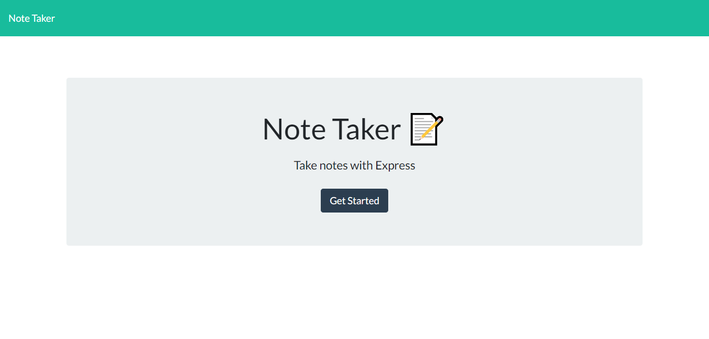
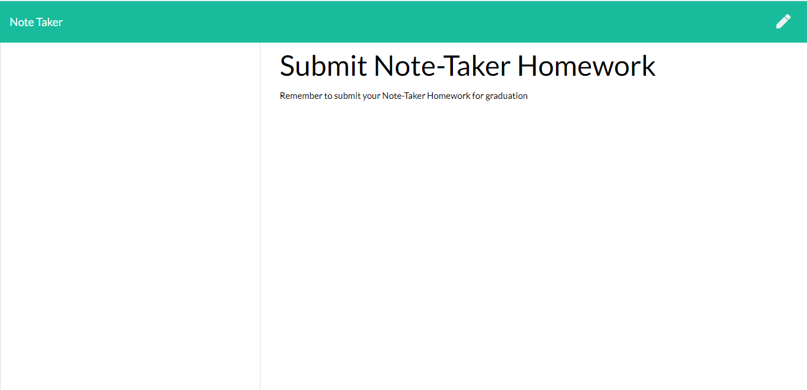

# Note-Taker

## Developement

This is a note-taking application. When a user opens the Note Taker then they are presented with a landing page with a link to a notes page. When the user clicks on the link to the notes page then they are presented with a page with existing notes listed in the left-hand column, plus empty fields to enter a new note title and the note’s text in the right-hand column.
When a new note title and the note’s text is entered then a Save icon appears in the navigation at the top of the page.

### Below are screenshots of the deplyed application:

